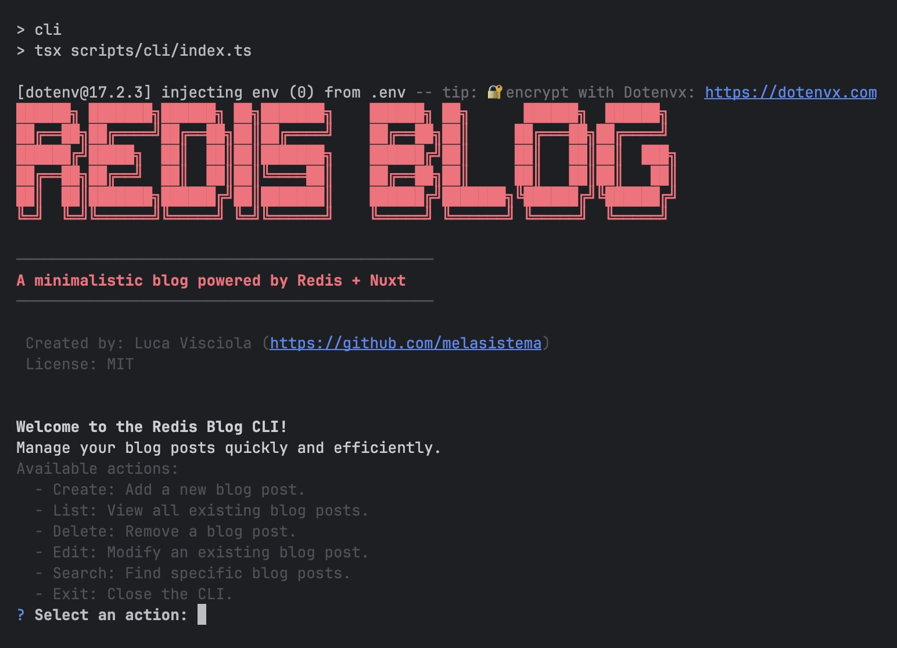
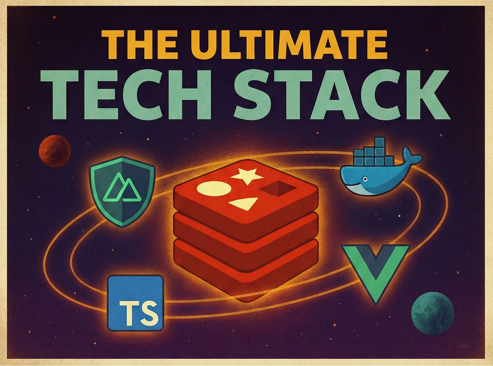
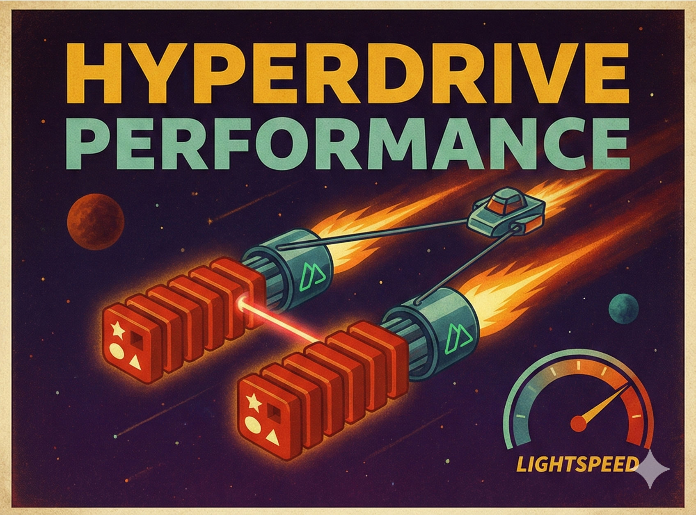

# 🚀 Redis Nuxt Blog

A modern, high-performance, and deeply customizable blog boilerplate built with Nuxt.js 3, Redis Stack, and Docker. This project is designed to be a powerful starting point for developers who want a fast, scalable, and feature-rich blog that can be fully customized in minutes from a single configuration file.


## ✨ Features

-   **🚀 Nuxt.js Frontend:** A fast and modern Vue.js framework for server-side rendering (SSR), providing excellent SEO and user experience.
-   **⚡ Redis as Primary Database:** Utilizes Redis Stack for ultra-fast data access, leveraging RedisJSON for efficient document storage.
-   **🎨 Deeply Customizable Theming:** Configure fonts, weights, a full color palette, and even the content width from a single configuration file, all powered by Tailwind CSS.
-   **💨 Utility-First Styling:** All styling is handled by Tailwind CSS for a clean, efficient, and highly maintainable development experience.
-   **⚙️ Feature Toggles:** Easily enable or disable features like pagination and post navigation to tailor the blog to your needs.
-   **📄 Dynamic Pagination:** Fully configurable pagination for the post list, with control over the number of posts per page.
-   **↔️ Post Navigation:** "Next" and "Previous" post links on single post pages to improve user engagement.
-   **🌐 Modern Favicon Support:** Comprehensive favicon setup for all modern devices, including a web app manifest.
-   **📦 Dockerized Environment:** Fully containerized with `docker-compose` for easy setup, consistent development, and reliable production deployments.
-   **📈 Sorted Sets for Timelines:** Efficiently retrieves posts in chronological order using Redis Sorted Sets.
-   **📝 Markdown Support:** Write post content using Markdown for rich text formatting, including headings, lists, and code blocks.
-   **📜 Seeding Script & CLI:** Includes scripts to populate the database with sample posts and a CLI to create, list, and delete posts.

## 🛠️ Tech Stack

-   **Frontend & API:** [Nuxt.js 3](https://nuxt.com/)
-   **Database:** [Redis Stack](https://redis.io/docs/latest/) (RedisJSON)
-   **Fonts:** [@nuxtjs/google-fonts](https://google-fonts.nuxtjs.org/)
-   **Styling:** [@nuxtjs/tailwindcss](https://tailwindcss.nuxtjs.org/)
-   **Containerization:** [Docker](https://www.docker.com/) & [Docker Compose](https://docs.docker.com/compose/)
-   **TypeScript Runtime:** [tsx](https://github.com/esbuild-kit/tsx)

## 🚀 Getting Started

Follow these instructions to get the project up and running on your local machine.

### Prerequisites

-   [Docker](https://www.docker.com/get-started) installed and running on your system.
-   [Node.js](https://nodejs.org/) (v18.x or later) and [npm](https://www.npmjs.com/) installed.

### 1. Clone the Repository

```bash
git clone 'git@github.com:melasistema/redis-blog.git'
cd 'redis-blog'
```

### 2. Install Dependencies

```bash
npm install
```

### 3. Running the Blog

The recommended way to run the project is with Docker Compose, which manages both the Nuxt application and the Redis database.

```bash
docker compose up -d --build
```

Once started, access the application at: [http://localhost:3000](http://localhost:3000)

### 4. Seed the Database

After the application is running, populate the Redis database with sample blog posts:

```bash
npm run seed
```

---

## ⚙️ Configuration

This blog is designed to be extensively customized through environment variables and a central configuration file.

### Environment Variables

Copy the `.env.example` file to `.env` for local development. These variables are essential for connecting to Redis and setting up the application's base URL.

```bash
cp .env.example .env
```

| Variable Name             | Description                                                                  | Default Value (for local dev)      |
|---------------------------|------------------------------------------------------------------------------|-----------------------------------|
| `NUXT_URL`                | Base URL for the Nuxt application. Essential for internal server-side requests. | `http://0.0.0.0:3000`          |
| `NUXT_HOST`               | The host address for the Nuxt development server.                            | `0.0.0.0`                         |
| `NUXT_PORT`               | The port for the Nuxt development server.                                    | `3000`                            |

| `REDIS_URL`               | Direct Redis connection URL for server-side and CLI scripts.                 | `redis://localhost:6380` |
| `DEFAULT_AUTHOR`          | The default author name for new posts created via the CLI.                   | `Melasistema`                       |

### Central Blog Configuration

The heart of the customization lies in **`config/blog.config.ts`**. This file allows you to control the entire look, feel, and behavior of your blog.

#### General

| Property       | Description                                              | Default Value      |
|----------------|----------------------------------------------------------|--------------------|
| `siteName`     | The name of your blog, used in titles and headers.       | `'Melasistema'`    |
| `contactEmail` | A contact email address.                                 | `'info@melasistema.com'` |
| `headerTitle`  | The main title displayed on the homepage header.         | `'This is your Blog...'` |
| `headerTagline`| The tagline displayed below the main title. Can include HTML. | `'A powerful and elegant...'` |
| `copyrightNotice` | The copyright notice in the footer. Uses `{year}` and `{siteName}` as placeholders. | `'© {year} {siteName}...'` |
| `copyrightUrl` | The URL the copyright notice links to.                   | `'https://github.com/melasistema'` |

#### Theming (Typography & Colors)

You can define your blog's entire visual identity, including fonts for each heading level and a full color palette. These values are used to dynamically generate the site's theme via Tailwind CSS.

```typescript
// config/blog.config.ts
export const defaultBlogConfig = {
  // ...
  typography: {
    body: { fontFamily: 'Englebert', weights: '100..900', italic: true },
    h1: { fontFamily: 'Englebert', weights: '700' },
    h2: { fontFamily: 'Englebert', weights: '600' },
    // ... and so on
  },
  colors: {
    primary: '#007bff',
    secondary: '#6c757d',
    text: '#212529',
    background: '#ffffff',
  },
};
```

#### Features

Easily toggle major features on or off.

| Section             | Property        | Description                                      | Default |
|---------------------|-----------------|--------------------------------------------------|---------|
| `pagination`        | `enabled`       | If `true`, enables pagination on the homepage.   | `true`  |
| `pagination`        | `postsPerPage`  | Number of posts to show on each page.            | `2`     |
| `postNavigation`    | `enabled`       | If `true`, shows "Next/Previous" post links.     | `true`  |
| `favicon`           | `enabled`       | If `true`, injects favicon links into the site.  | `true`  |
| `postExcerpt`       | `enabled`       | If `true`, displays an excerpt of posts on the homepage. | `true`  |
| `postExcerpt`       | `maxLength`     | Maximum length of the post excerpt.              | `250`   |
| `contentMaxWidth`   | -               | Sets the max-width of the main content container. Accepts any valid CSS width (e.g., `'800px'`, `'60rem'`). | `'512px'` |

#### Favicon

To use your own favicon:
1.  Add your favicon files to the `/public` directory.
2.  The boilerplate is set up to find `favicon.svg`, `apple-touch-icon.png`, `icon-192.png`, `icon-512.png`, and `manifest.webmanifest`.
3.  Simply replace the placeholder files with your own assets.

## 🛠️ How To (CLI)



Manage your blog's content directly from the command line using the interactive CLI menu.

To launch the CLI, run:
```bash
npm run cli
```

This will present you with a main menu to choose from the following actions:

*   **Create new post**: Add a new blog post. You will be prompted for a title, multi-line content (type `(end)` on a new line to finish), tags, and author.
*   **List all posts**: Display a comprehensive list of all posts currently stored in Redis.
*   **Delete a post**: Interactively select and remove an existing blog post. It will first show a full list of posts, then allow you to choose one to delete.
*   **Edit a post**: Select a post to modify its title, tags, author, and content. The content will open in your system's default command-line editor (e.g., Vim, Nano).
*   **Search posts**: Find specific blog posts using RediSearch query syntax (e.g., `"redis blog"`, `@tags:{tutorial}`, `@title:custom`, `@content:custom`).
*   **Exit**: Close the CLI.

Follow the on-screen prompts to perform your desired action.

## 🔌 API Endpoints

| Endpoint           | Method | Description                                                                   |
|--------------------|--------|-------------------------------------------------------------------------------|
| `/api/posts`       | `GET`  | Retrieves a list of posts. Supports `?page=N` for pagination.                 |
| `/api/posts/:slug` | `GET`  | Retrieves a single post and its next/previous neighbors.                      |
| `/api/tags`        | `GET`  | Retrieves a list of all unique tags.                                          |

## 🌟 Credits

-   **👨‍💻 Author**: [Luca Visciola](https://github.com/melasistema) – Passionate drummer and developer. Reach out at [info@melasistema.com](mailto:info@melasistema.com).
-   **🚀 Inspired by [Salvatore Sanfilippo](https://github.com/antirez)**: The creator of [Redis](https://github.com/redis/redis), whose work is a constant source of inspiration.

The Ultimate Tech Stack | Hyperdrive Performance
--- | ---
 |  

## 📝 License

This project is licensed under the MIT License. See the [LICENSE](./LICENSE) file for details.
